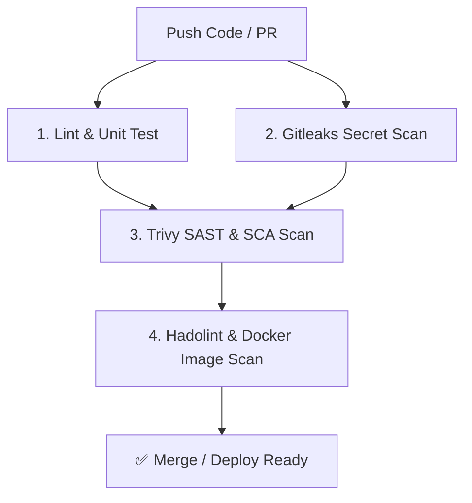

# 🚀 DevSecOps GitHub Boilerplate Project

[](https://github.com/your-username/your-repo/actions)
[](LICENSE)
[](https://www.python.org/downloads/)
[](Dockerfile)

Đây là bộ **khung dự án (Boilerplate / Skeleton)** chuẩn được thiết kế sẵn để push lên GitHub, tích hợp quy trình **DevSecOps CI/CD Pipeline** tự động kiểm tra chất lượng mã nguồn và bảo mật toàn diện theo triết lý **Shift-Left**.

---

## 📁 Cấu Trúc Dự Án (Project Structure)

```text
.
├── .github/
│   ├── workflows/
│   │   └── ci-devsecops.yml    # Luồng CI/CD GitHub Actions (Lint, Test, Secret Scan, SAST, Docker Scan)
│   ├── dependabot.yml           # Tự động cập nhật thư viện bị dính lỗ hổng CVE
│   ├── PULL_REQUEST_TEMPLATE.md # Template khi mở PR (kèm DevSecOps Checklist)
│   └── SECURITY.md              # Chính sách báo cáo lỗ hổng bảo mật
├── src/
│   ├── __init__.py
│   └── main.py                  # Mã nguồn chính ứng dụng FastAPI (có endpoint /health)
├── tests/
│   ├── __init__.py
│   └── test_main.py             # Bộ Unit test tự động với pytest
├── Dockerfile                   # Dockerfile chuẩn Best Practice (Multi-stage, Non-root user)
├── .dockerignore                # Loại bỏ file thừa khi build Docker
├── .gitignore                   # Loại bỏ file rác & secrets khỏi Git
├── .gitleaks.toml               # Cấu hình quét Secret Leakage
├── requirements.txt             # Khai báo thư viện phụ thuộc Python
├── roadmap.md                   # Lộ trình học DevSecOps đầy đủ
└── README.md                    # Tài liệu hướng dẫn dự án
```

---

## 🛡️ Các Tính Năng Bảo Mật Tích Hợp (DevSecOps Features)

| Giai đoạn | Hoạt động Bảo mật | Công cụ sử dụng |
| :--- | :--- | :--- |
| **Lint & Quality** | Kiểm tra cú pháp & phong cách code | `Flake8` |
| **Unit Test** | Chạy kiểm thử tự động | `pytest` |
| **Secret Scan** | Phát hiện API Key, Passwords trong commit | `Gitleaks` |
| **SAST & SCA** | Phân tích lỗi bảo mật source code & thư viện 3rd party | `Trivy (FS Mode)` / `Semgrep` |
| **Dockerfile Lint** | Kiểm tra cấu hình Dockerfile chuẩn bảo mật | `Hadolint` |
| **Container Scan** | Quét lỗ hổng image Docker trước khi deploy | `Trivy (Image Mode)` |
| **Dependency Updates** | Tự động quét và nâng cấp gói bị lỗi bảo mật | `Dependabot` |

---

## 💻 Hướng Dẫn Chạy Cục Bộ (Local Setup)

### 1. Yêu cầu hệ thống
- Python >= 3.11
- Docker (nếu chạy bằng container)

### 2. Cài đặt và chạy ứng dụng Python
```bash
# Tạo và kích hoạt môi trường ảo
python -m venv venv
source venv/bin/activate  # Trên Linux/macOS
# venv\Scripts\activate   # Trên Windows

# Cài đặt thư viện
pip install -r requirements.txt

# Chạy Unit Tests
pytest tests/ -v

# Chạy Server ứng dụng
uvicorn src.main:app --reload --port 8000
```
Truy cập ứng dụng tại: `http://localhost:8000`  
Endpoint kiểm tra health: `http://localhost:8000/health`

---

## 🐳 Hướng Dẫn Chạy Bằng Docker (Container Build)

```bash
# Build Docker Image
docker build -t devsecops-app:latest .

# Chạy Container
docker run -d -p 8000:8000 --name app-instance devsecops-app:latest

# Kiểm tra log container
docker logs -f app-instance
```

---

## ⚙️ Luồng CI/CD Trên GitHub Actions

Khi bạn push code hoặc mở Pull Request lên branch `main` / `master`, GitHub Actions sẽ tự động kích hoạt pipeline:



---

## 📜 Giấy Phép (License)

Dự án này được phát hành dưới giấy phép [MIT License](LICENSE).
