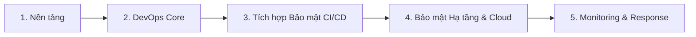

# Lộ Trình Học DevSecOps Cơ Bản (DevSecOps Roadmap)

> **DevSecOps** (Development - Security - Operations) là phương pháp luận tích hợp bảo mật vào mọi giai đoạn của chu kỳ phát triển phần mềm (SDLC), theo triết lý **Shift-Left** (Đưa bảo mật lên trước).

---

## 🗺️ Tổng Quan Lộ Trình (Overview Diagram)



---

## 📌 Giai Đoạn 1: Kiến Thức Nền Tảng (Foundations)

### 1.1. Hệ Điều Hành & Linux
- [ ] Thành thạo Linux CLI (Ubuntu, Debian, RHEL, Alpine).
- [ ] Quản lý User, Permission, SSH Keys, File Attributes, Sudoers.
- [ ] Xử lý tiến trình, tài nguyên hệ thống, Systemd / Services.

### 1.2. Mạng & Bảo Mật Mạng Căn Bản (Networking & Network Security)
- [ ] Các giao thức cốt lõi: TCP/IP, UDP, HTTP/HTTPS, DNS, SSH, TLS/SSL.
- [ ] Khái niệm Firewall, NAT, VPN, Reverse Proxy (Nginx, HAProxy).
- [ ] Cấu hình chứng chỉ SSL/TLS (Let's Encrypt, Cert-Manager).

### 1.3. Lập Trình & Scripting
- [ ] **Bash/Shell Scripting**: Tự động hóa công việc trên Linux.
- [ ] **Python / Go**: Viết script tương tác API, công cụ kiểm tra tự động.
- [ ] Đọc và hiểu code để review lỗ hổng bảo mật cơ bản.

### 1.4. Quản Lý Mã Nguồn (Version Control Systems - Git)
- [ ] Thành thạo Git Workflow (Branching strategy, Pull Request / Merge Request).
- [ ] Quản lý quyền truy cập Repository, Branch Protection Rules.
- [ ] Ký commit bằng GPG Key (Commit Signing).

---

## 📌 Giai Đoạn 2: DevOps Core & Automation

### 2.1. CI/CD Pipelines
- [ ] Xây dựng luồng tự động hóa với **GitHub Actions**, **GitLab CI/CD**, **Jenkins**, hoặc **Azure DevOps**.
- [ ] Khái niệm Pipeline Stages (Lint -> Build -> Test -> Deploy).
- [ ] Quản lý biến môi trường (Environment Variables) & Secret cơ bản.

### 2.2. Đóng Gói Ứng Dụng (Containerization)
- [ ] Thành thạo **Docker**: Dockerfile Best Practices (Multi-stage build, Non-root user).
- [ ] Quản lý Container Registry (Docker Hub, GHCR, AWS ECR, Harbor).
- [ ] Quét lỗ hổng Container Image căn bản (Trivy, Grype).

### 2.3. Hạ Tầng Như Mã (Infrastructure as Code - IaC)
- [ ] **Terraform**: Quản lý hạ tầng bằng code (Providers, State Management).
- [ ] **Ansible**: Quản lý cấu hình (Configuration Management), Hardening máy chủ.

### 2.4. Điện Toán Đám Mây (Cloud Fundamentals)
- [ ] Nắm vững 1 dịch vụ Cloud (AWS, GCP, hoặc Azure).
- [ ] Quản lý danh tính và phân quyền: **IAM (Identity & Access Management)**, Principle of Least Privilege.
- [ ] Cloud Networking: VPC, Security Groups, NACL, Subnets.

---

## 📌 Giai Đoạn 3: Tích Hợp Bảo Mật Vào CI/CD (Security Integration / Shift-Left)

Tích hợp tự động các công cụ bảo mật vào từng bước của luồng CI/CD:

```
[ Code ] ➔ SAST / SCA / Secret Scan
   ↓
[ Build ] ➔ Container Image Scan / IaC Scan
   ↓
[ Test ] ➔ DAST / API Security Scan
   ↓
[ Deploy ] ➔ Runtime Security / Policy Enforcement
```

### 3.1. Secret Management & Secret Scanning (Quản lý & Quét bí mật)
- **Mục tiêu**: Ngăn chặn leak API keys, Passwords, Certificates vào Git repository.
- **Công cụ**:
  - Quét secret: `Gitleaks`, `TruffleHog`.
  - Quản lý secret tập trung: `HashiCorp Vault`, `AWS Secrets Manager`, `SOPS`.

### 3.2. Software Composition Analysis (SCA - Bảo mật thư viện 3rd Party)
- **Mục tiêu**: Kiểm tra các thư viện phụ thuộc (Dependencies) có dính lỗ hổng (CVE) hay không.
- **Công cụ**: `OWASP Dependency-Check`, `Snyk`, `Dependabot`, `Trivy`.

### 3.3. Static Application Security Testing (SAST - Quét mã nguồn tĩnh)
- **Mục tiêu**: Phân tích source code tìm lỗ hổng bảo mật (SQL Injection, XSS, Hardcoded secrets...) mà không cần chạy ứng dụng.
- **Công cụ**: `SonarQube`, `Semgrep`, `Checkmarx`, `Bandit` (Python), `Gosec` (Go).

### 3.4. Dynamic Application Security Testing (DAST - Quét bảo mật động)
- **Mục tiêu**: Kiểm thử ứng dụng khi đang chạy (Black-box testing) để tìm lỗ hổng runtime.
- **Công cụ**: `OWASP ZAP`, `Nuclei`, `Nikto`.

### 3.5. Infrastructure as Code Scanning (IaC Security)
- **Mục tiêu**: Phát hiện cấu hình sai (Misconfigurations) trong file Terraform, Dockerfile, K8s Manifests.
- **Công cụ**: `Checkov`, `tfsec`, `KICS`, `Hadolint` (Docker).

---

## 📌 Giai Đoạn 4: Bảo Mật Hạ Tầng & Orchestration (K8s & Cloud Security)

### 4.1. Kubernetes Security
- [ ] **RBAC (Role-Based Access Control)**: Phân quyền truy cập cluster.
- [ ] **Network Policies**: Cấu hình firewall nội bộ giữa các Pods.
- [ ] **Pod Security Standards (PSS) & Admission Controllers**: Sử dụng `Kyverno` hoặc `OPA Gatekeeper` để chặn Pod vi phạm chính sách bảo mật.
- [ ] **Runtime Security**: Phát hiện hành vi bất thường trong container bằng `Falco`.

### 4.2. Hardening & Compliance as Code
- [ ] Áp dụng tiêu chuẩn bảo mật **CIS Benchmarks** (cho Linux, Docker, K8s, Cloud).
- [ ] Công cụ kiểm tra tuân thủ: `OpenSCAP`, `Kube-bench`.

---

## 📌 Giai Đoạn 5: Giám Sát, Quản Lý Lỗ Hổng & Ứng Cứu (Continuous Monitoring & Feedback)

### 5.1. Continuous Monitoring & Logging
- [ ] Thu thập log tập trung (Centralized Logging): **ELK Stack (Elasticsearch, Logstash, Kibana)** hoặc **Grafana Loki**.
- [ ] Giám sát hạ tầng & ứng dụng: **Prometheus**, **Grafana**.
- [ ] **SIEM / Cloud Trail**: Giám sát nhật ký sự cố an ninh mạng.

### 5.2. Quản Lý Lỗ Hổng Tập Trung (Vulnerability Management)
- [ ] Thu thập kết quả từ SAST, DAST, SCA, Container Scan về một nơi.
- [ ] Công cụ quản lý: **DefectDojo**, **Faraday**.
- [ ] Định nghĩa quy trình phân loại (Triage), ưu tiên và khắc phục lỗ hổng.

### 5.3. Threat Modeling (Mô hình hóa mối đe dọa)
- [ ] Hiểu khái niệm Mô hình hóa mối đe dọa trong giai đoạn thiết kế (Design Phase).
- [ ] Khung đánh giá: **STRIDE**, **PASTA**.
- [ ] Công cụ: `OWASP Threat Dragon`, `TMT (Microsoft Threat Modeling Tool)`.

---

## 📊 Bảng Tổng Hợp Công Cụ DevSecOps Theo Chu Kỳ SDLC

| Giai đoạn SDLC | Hoạt động Bảo mật | Công cụ phổ biến (Open Source / Popular) |
| :--- | :--- | :--- |
| **Plan / Design** | Threat Modeling | OWASP Threat Dragon, Microsoft TMT |
| **Code** | Secret Scan, SAST (IDE) | Gitleaks, TruffleHog, Semgrep |
| **Build** | SCA, SAST, Docker Scan | SonarQube, Snyk, Trivy, Hadolint |
| **Test** | DAST, API Security Scan | OWASP ZAP, Nuclei |
| **Deploy** | IaC Security, K8s Policy | Checkov, tfsec, Kyverno, OPA |
| **Operate** | Runtime Protection, Hardening | Falco, Kube-bench, CIS Benchmarks |
| **Monitor** | Logging, SIEM, Vulnerability Mgmt | DefectDojo, Grafana, ELK, Prometheus |

---

## 📜 Chứng Chỉ & Tài Nguyên Tham Khảo

### Chứng chỉ đề xuất (Certifications)
1. **Certified DevSecOps Professional (CDP)** - Practical DevSecOps
2. **Certified Kubernetes Security Specialist (CKS)** - CNCF
3. **AWS Certified Security - Specialty** / **Azure Security Engineer (AZ-500)**
4. **GIAC Cloud Security Automation (GCSA)**

### Tài nguyên học tập
- [OWASP Top 10 Application Security Risks](https://owasp.org/www-project-top-ten/)
- [OWASP DevSecOps Guideline](https://owasp.org/www-project-devsecops-guidelines/)
- [CIS Benchmarks](https://www.cisecurity.org/cis-benchmarks)
- [DevSecOps Roadmap on roadmap.sh](https://roadmap.sh/devops)
